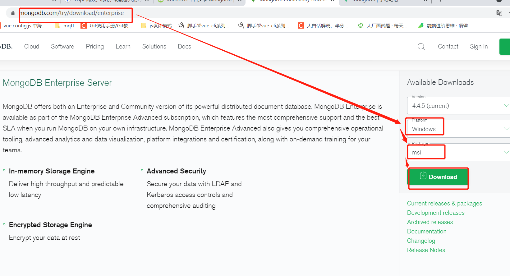

## 安装

1. 下载
   从 MongoDB 官网下载安装，MongoDB 预编译二进制包下载地址：[https://www.mongodb.com/download-center/community](https://www.mongodb.com/download-center/community)



2. 双击下载的 msi 文件，进行安装
3. 同意协议，下一步选择 custom 自定义安装，选择安装目录
4. 作为一个服务安装，默认即可
5. 安装 "install mongoDB compass" 不勾选
6. 进入安装目录下的 bin 目录下，打开命令行工具，输入 mongo 命令
7. 把安装目录下的 bin 目录添加到环境变量

## 使用

1. 打开命令行工具，输入 mongo

```
mongo
```

2. 查看版本

```
mongo
```

3. 查看当前使用的数据库

```
db
```

4. 查看所有数据库

```
show dbs
或：
show databases
```

5. 创建数据库 && 选择数据库（进入数据库）

```
use 数据库名
```

6. 查看集合 collection

```
show tables
或：
show collections
```

7. 查询集合（表）数据

```
db.表名.find()
如：
db.user.find()
```

8 . 添加数据

```
db.集合名.insert(文档)
如：
db.user.insert({
    name: "张三",
    age: 18
})
```
