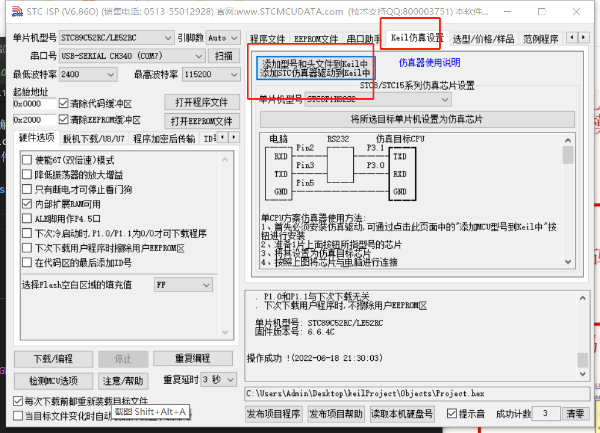
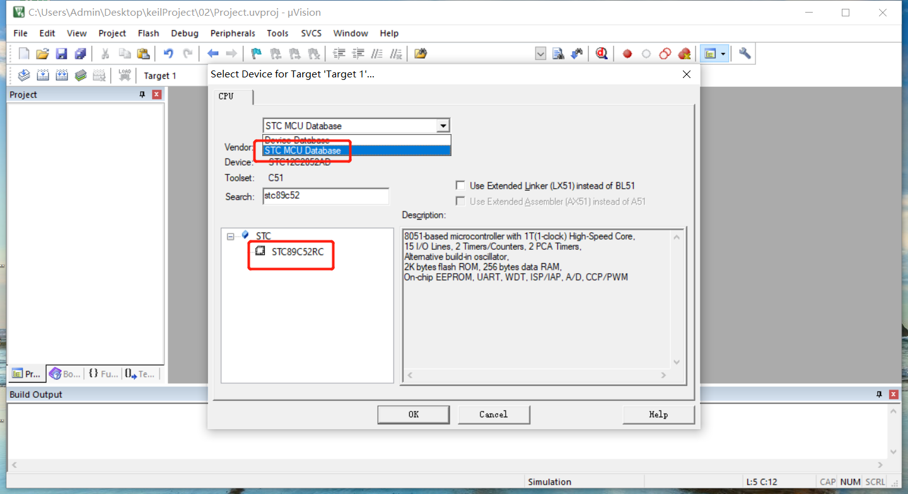
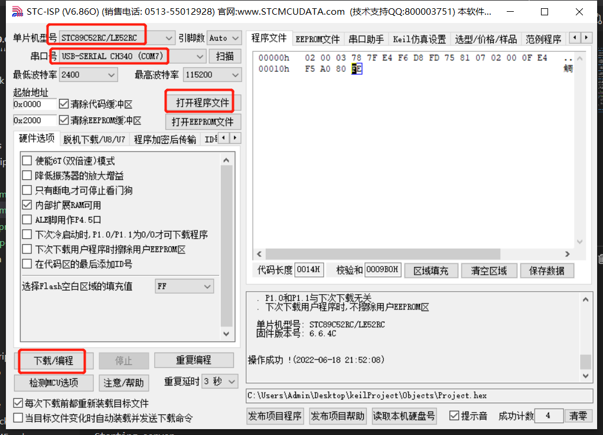

# 开发环境搭建

##### 下载keil和stc-isp软件

链接：https://pan.baidu.com/s/1F4UrqezIvT64AAmVFIylTQ 

提取码：ge4e

##### 安装keil软件

> 安装后要破解，首先以管理员身份打开keil软件，复制keil软件的CID，CID在工具栏File下的License Management菜单，打开注册机把CID复制到相应位置，获取LIC，复制到keil软件内，确认即可

##### keil软件的配置

- 配置字符编码为utf-8
- 配置输出hex文件

##### stc-isp软件无需安装，打开即可使用

> 软件右侧窗口菜单：keil仿真设置-添加型号和头文件到keil中（添加STC仿真器驱动到keil中），点击确定即可



##### 新建项目工程，点亮led灯

> 打开keil软件，Project-New uVision Project-输入文件名：Project，选择单片机型号，如下



> add new item to group source...，添加main.c文件，创建成功后，文件中右键添加头文件，文件内容如下

```c
// 引入的头文件
#include <STC89C5xRC.H>

// 入口函数
void main()
{
	// p2端为8个led小灯
	P2 = 0x00;

	// 一直循环，一直运行
	while(1);
}
```


##### 固件灌装（把生成的hex文件下载到开发板中）



重新打开开发板的开关即可
