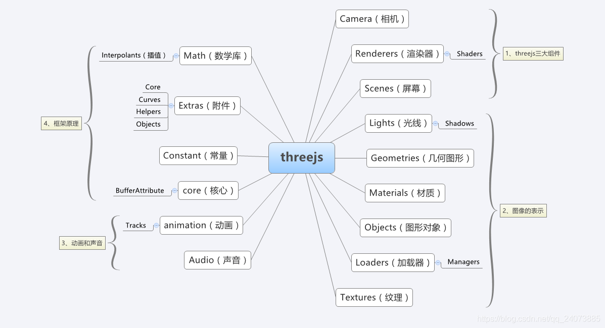

# 学习资源

1，官方网站：[https://threejs.org/](https://threejs.org/)

2，官方文档：[https://threejs.org/docs/](https://threejs.org/docs/)

3，官方手册：[https://threejs.org/manual/](https://threejs.org/manual/)

4，入门视频：[快速上手 Three.js](https://www.bilibili.com/video/BV1zU4y1L7Go?spm_id_from=333.337.search-card.all.click)

##### 基础

1，官方手册：

- [https://threejs.org/manual/#zh/fundamentals](https://threejs.org/manual/#zh/fundamentals)

- [https://threejs.org/manual/#zh/primitives](https://threejs.org/manual/#zh/primitives)

- [https://threejs.org/manual/#zh/scenegraph](https://threejs.org/manual/#zh/scenegraph)

...

##### 示例demo

- [https://threejs.org/examples/#css3d_periodictable](https://threejs.org/examples/#css3d_periodictable)

##### 3D模型网站

- [https://sketchfab.com/](https://sketchfab.com/)

##### 博客文章

- https://ericli.blog.csdn.net/article/details/117667697?spm=1001.2101.3001.6650.1&utm_medium=distribute.pc_relevant.none-task-blog-2%7Edefault%7ECTRLIST%7ERate-1.pc_relevant_aa&depth_1-utm_source=distribute.pc_relevant.none-task-blog-2%7Edefault%7ECTRLIST%7ERate-1.pc_relevant_aa&utm_relevant_index=2

- https://blog.csdn.net/qq_30100043/category_7003591.html

- https://blog.csdn.net/u014291990/category_8071173_3.html
