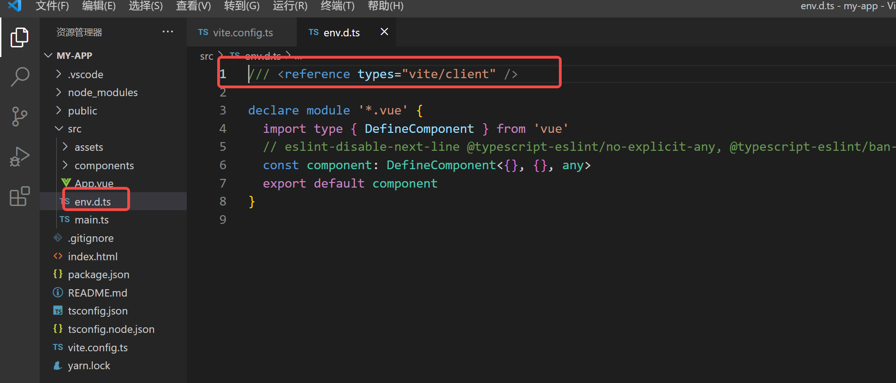

手册指南-接口：https://www.tslang.cn/docs/handbook/interfaces.html

菜鸟教程：https://www.runoob.com/typescript/ts-namespace.html

##### 对象字面量
>【对象字面量】会被特殊对待而且会经过 额外属性检查，当将它们【赋值给变量】或【作为参数传递】的时候。如果一个对象字面量存在任何“目标类型”不包含的属性时，你会得到一个错误。

解决方案有三:

1, 最low：直接把对象字面量赋值给一个变量，这个变量不声明类型，然后把变量【赋值给变量】或【作为参数传递】

2, 也low：把字面量对象包装下，比如使用Object.create({})，或new Object({})

2，最简便：使用类型断言

3，最佳：添加一个字符串【索引签名】

##### 命名空间之-///用法
> 如果一个命名空间在一个单独的 TypeScript 文件中，则应使用三斜杠 /// 引用它，语法格式如下：

文档地址：https://www.runoob.com/typescript/ts-namespace.html
```javascript
/// <reference path = "SomeFileName.ts" />
```

> vue3+vite+ts中用到了这个知识点

```javascript
yarn create vite myapp --template vue-ts
```
